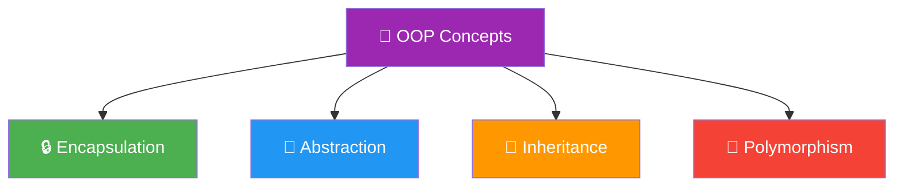
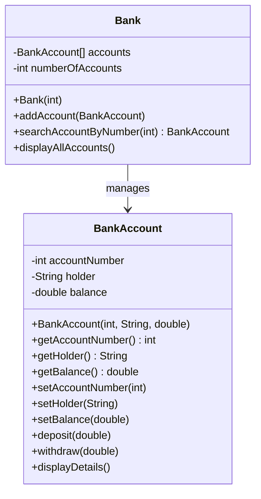
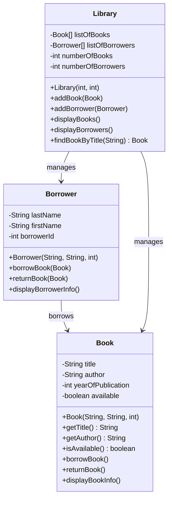
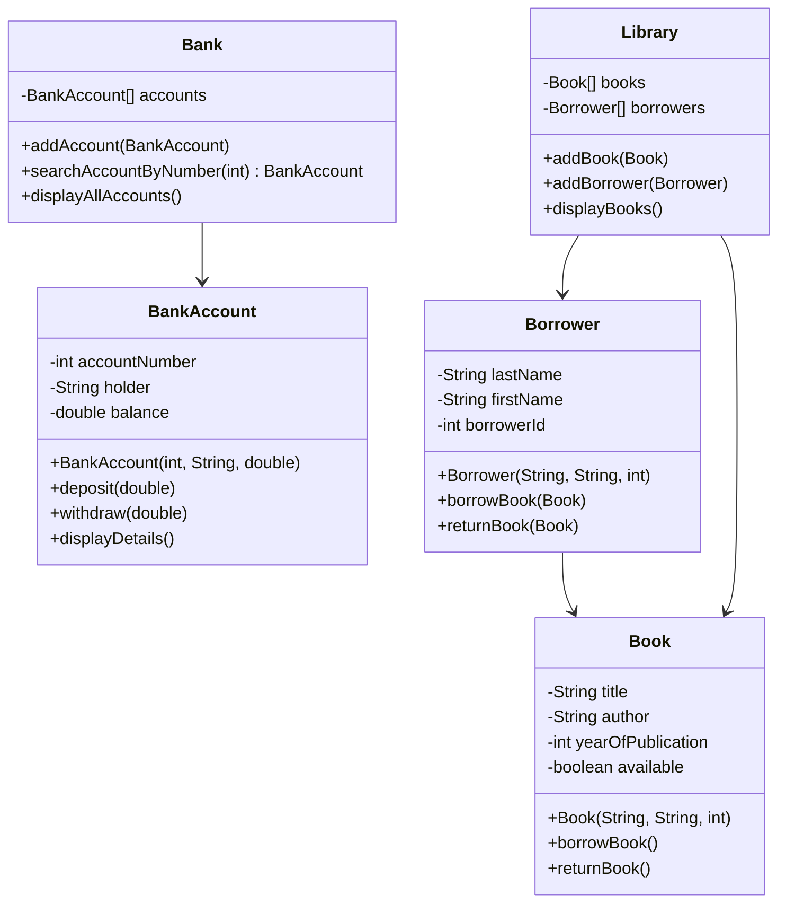

# 🏦 Java OOP: Bank & Library Management System

<p align="left">
  
  
  
  
</p>

---

## 📋 Table of Contents

| Section | Description | Icon |
|---------|-------------|------|
| [1. Overview](#1-overview) | Project introduction | 🏠 |
| [2. OOP Concepts](#2-oop-concepts) | Detailed OOP concepts | 🧠 |
| [3. Encapsulation](#3-encapsulation) | Data protection | 🔒 |
| [4. Classes & Objects](#4-classes--objects) | Building blocks | 🏗️ |
| [5. Constructors](#5-constructors) | Object initialization | 🏗️ |
| [6. Methods](#6-methods) | Behavior implementation | ⚙️ |
| [7. Arrays](#7-arrays) | Collections of objects | 📊 |
| [8. Code Examples](#8-code-examples) | Real code from project | 💻 |
| [9. Bank System](#9-bank-system) | Banking details | 🏦 |
| [10. Library System](#10-library-system) | Library details | 📚 |
| [11. Running Code](#11-running-code) | Execution guide | ▶️ |
| [12. UML Diagrams](#12-uml-diagrams) | Class diagrams | 📊 |
| [13. Features](#13-features) | Key features | ✨ |
| [14. Exercises](#14-exercises) | Practice exercises | 📝 |
| [15. FAQ](#15-faq) | Help section | ❓ |
| [16. Resources](#16-resources) | Learning resources | 📚 |
| [17. License](#17-license) | License info | 📝 |
| [18. Author](#18-author) | Author info | 👤 |

---

## 1. Overview <a name="1-overview"></a>

> 💡 **Course:** TP 03 - Classes et Objets  
> 🎓 **Institution:** EMSI (École Marocaine des Sciences de l'Ingénieur)  
> 👨‍💻 **Author:** Youssef Lagmouch  
> 📅 **Date:** 2026

This Java project demonstrates **Object-Oriented Programming (OOP)** concepts through two practical management systems. This README provides a detailed explanation of the OOP concepts used in this project.

---

## 2. OOP Concepts Overview <a name="2-oop-concepts"></a>

The four pillars of Object-Oriented Programming:



### Concepts Implemented in This Project

| Concept | Implemented | Description |
|---------|-------------|-------------|
| 🔒 Encapsulation | ✅ YES | Private attributes with getters/setters |
| 🏗️ Classes & Objects | ✅ YES | BankAccount, Book, Borrower, etc. |
| 🏗️ Constructors | ✅ YES | Parameterized constructors |
| ⚙️ Methods | ✅ YES | deposit, withdraw, borrowBook, etc. |
| 📊 Arrays | ✅ YES | Managing collections |
| 🧬 Inheritance | ❌ NOT USED | Could be added |
| 🎯 Abstraction | ❌ NOT USED | Could use abstract classes |
| 🔄 Polymorphism | ❌ NOT USED | Could be added with interfaces |

---

## 3. Encapsulation <a name="3-encapsulation"></a>

### What is Encapsulation?

**Encapsulation** is the bundling of data (attributes) and methods into a single unit (class), and restricting access to some of the object's components.

### Encapsulation in This Project

All classes in this project use **encapsulation** with:
- **Private attributes** - Data is hidden from outside access
- **Public getters** - Read-only access to data
- **Public setters** - Controlled modification of data

### Example from BankAccount.java

```java
package bank;

public class BankAccount {
    // 🔒 PRIVATE ATTRIBUTES - Encapsulation
    // These cannot be accessed directly from outside the class
    private int accountNumber;
    private String holder;
    private double balance;

    // 📖 GETTER METHODS - Read access
    // Allow external code to read private data safely
    public int getAccountNumber() {
        return accountNumber;
    }

    public String getHolder() {
        return holder;
    }

    public double getBalance() {
        return balance;
    }

    // ✏️ SETTER METHODS - Write access with control
    // Allow external code to modify data with validation
    public void setAccountNumber(int accountNumber) {
        this.accountNumber = accountNumber;
    }

    public void setHolder(String holder) {
        this.holder = holder;
    }

    public void setBalance(double balance) {
        this.balance = balance;
    }

    // 💰 BUSINESS LOGIC - Controlled operations
    public void deposit(double amount) {
        if (amount > 0) {
            balance = balance + amount;
            System.out.println("Deposit of " + amount + "€ made. New balance: " + balance + "€");
        } else {
            System.out.println("The amount must be positive");
        }
    }

    public void withdraw(double amount) {
        if (amount > 0) {
            if (amount <= balance) {
                balance = balance - amount;
                System.out.println("Withdrawal of " + amount + "€ made. New balance: " + balance + "€");
            } else {
                System.out.println("Insufficient balance. You have " + balance + "€");
            }
        } else {
            System.out.println("The amount must be positive");
        }
    }
}
```

### Benefits of Encapsulation

| Benefit | Description |
|---------|-------------|
| 🔒 Data Protection | Prevents unauthorized access |
| ✅ Validation | Setters can validate data |
| 🔧 Flexibility | Easy to change internal implementation |
| ♻️ Reusability | Code can be reused across projects |

---

## 4. Classes & Objects <a name="4-classes--objects"></a>

### What is a Class?

A **class** is a blueprint or template that defines the structure and behavior of objects.

### What is an Object?

An **object** is an instance of a class - a concrete realization of the blueprint.

### Classes in This Project

| Class | Package | Purpose |
|-------|---------|---------|
| 🏦 BankAccount | bank | Represents a bank account |
| 🏛️ Bank | bank | Manages bank accounts |
| 📖 Book | library | Represents a book |
| 👤 Borrower | library | Represents a borrower |
| 🏛️ Library | library | Manages books and borrowers |

### Class: BankAccount (from BankAccount.java)

```java
// 🏗️ CLASS DEFINITION
// A class is a blueprint for creating objects
public class BankAccount {
    // 📦 ATTRIBUTES (also called fields or properties)
    // These define the data that objects of this class will have
    private int accountNumber;    // Account ID
    private String holder;         // Account holder name
    private double balance;        // Current balance

    // 🏗️ CONSTRUCTOR
    // Special method called when creating a new object
    public BankAccount(int accountNumber, String holder, double balance) {
        this.accountNumber = accountNumber;
        this.holder = holder;
        this.balance = balance;
    }

    // ⚙️ METHODS
    // Define the behavior of objects
    public void deposit(double amount) { /* ... */ }
    public void withdraw(double amount) { /* ... */ }
    public void displayDetails() { /* ... */ }
}
```

### Creating Objects (Instantiation)

```java
// 🎯 CREATING OBJECTS
// Using the 'new' keyword to instantiate a class

// Create a BankAccount object
BankAccount account1 = new BankAccount(1001, "John Doe", 5000.0);

// Create another BankAccount object
BankAccount account2 = new BankAccount(1002, "Jane Smith", 10000.0);

// Create Book objects
Book book1 = new Book("The Great Gatsby", "F. Scott Fitzgerald", 1925);
Book book2 = new Book("1984", "George Orwell", 1949);

// Create Borrower objects
Borrower borrower1 = new Borrower("Benali", "Ahmed", 1);
Borrower borrower2 = new Borrower("Mansouri", "Sara", 2);

// Create Library object
Library library = new Library(100, 50);
```

---

## 5. Constructors <a name="5-constructors"></a>

### What is a Constructor?

A **constructor** is a special method that:
- Has the same name as the class
- Is called when an object is created using `new`
- Initializes the object's attributes
- Has no return type (not even void)

### Types of Constructors

This project uses **Parameterized Constructors**:

#### BankAccount Constructor (from BankAccount.java)

```java
// 🏗️ PARAMETERIZED CONSTRUCTOR
// Accepts parameters to initialize object state
public BankAccount(int accountNumber, String holder, double balance) {
    // 'this' keyword refers to the current object
    this.accountNumber = accountNumber;  // Initialize accountNumber
    this.holder = holder;                 // Initialize holder
    this.balance = balance;               // Initialize balance
}
```

#### Book Constructor (from Book.java)

```java
// 📖 BOOK CONSTRUCTOR
public Book(String title, String author, int yearOfPublication) {
    this.title = title;
    this.author = author;
    this.yearOfPublication = yearOfPublication;
    this.available = true;  // Default value: books are available when created
}
```

#### Borrower Constructor (from Borrower.java)

```java
// 👤 BORROWER CONSTRUCTOR
public Borrower(String lastName, String firstName, int borrowerId) {
    this.lastName = lastName;
    this.firstName = firstName;
    this.borrowerId = borrowerId;
}
```

#### Library Constructor (from Library.java)

```java
// 🏛️ LIBRARY CONSTRUCTOR
// Initializes arrays for books and borrowers
public Library(int maxBooks, int maxBorrowers) {
    this.listOfBooks = new Book[maxBooks];       // Create books array
    this.listOfBorrowers = new Borrower[maxBorrowers]; // Create borrowers array
    this.numberOfBooks = 0;                       // Initialize counter
    this.numberOfBorrowers = 0;                   // Initialize counter
}
```

### Constructor Usage

```java
// Creating objects with constructors
BankAccount account = new BankAccount(1001, "John Doe", 5000.0);
Book book = new Book("1984", "George Orwell", 1949);
Borrower borrower = new Borrower("Benali", "Ahmed", 1);
Library library = new Library(100, 50);  // Max 100 books, 50 borrowers
```

---

## 6. Methods <a name="6-methods"></a>

### What is a Method?

A **method** is a block of code that performs a specific task. Methods define the behavior of objects.

### Types of Methods in This Project

| Method Type | Example | Description |
|------------|---------|-------------|
| �.getter | getBalance() | Returns attribute value |
| 📥 Setter | setBalance() | Modifies attribute value |
| 💼 Business | deposit() | Performs specific operation |
| 📊 Display | displayDetails() | Shows information |

### Method Examples from BankAccount.java

```java
// 📥 GETTER METHOD
// Returns the balance - read-only access
public double getBalance() {
    return balance;  // Returns the value of balance
}

// 📤 SETTER METHOD  
// Sets the balance - controlled modification
public void setBalance(double balance) {
    this.balance = balance;  // Assign new value
}

// 💼 BUSINESS LOGIC METHOD
// deposit - adds money to account
public void deposit(double amount) {
    // Validation: check if amount is positive
    if (amount > 0) {
        balance = balance + amount;  // Update balance
        System.out.println("Deposit of " + amount + "€ made. New balance: " + balance + "€");
    } else {
        System.out.println("The amount must be positive");
    }
}

// 💼 BUSINESS LOGIC METHOD
// withdraw - removes money from account (with validation)
public void withdraw(double amount) {
    if (amount > 0) {
        // Validation: check sufficient balance
        if (amount <= balance) {
            balance = balance - amount;
            System.out.println("Withdrawal of " + amount + "€ made. New balance: " + balance + "€");
        } else {
            System.out.println("Insufficient balance. You have " + balance + "€");
        }
    } else {
        System.out.println("The amount must be positive");
    }
}

// 📊 DISPLAY METHOD
// Shows all account information
public void displayDetails() {
    System.out.println("Number: " + accountNumber);
    System.out.println("Holder: " + holder);
    System.out.println("Balance: " + balance + "€");
    System.out.println("---------------");
}
```

### Method Examples from Book.java

```java
// 📖 BORROW METHOD
// Marks book as borrowed (only if available)
public void borrowBook() {
    if (available) {
        available = false;  // Change status to unavailable
        System.out.println(" Book \"" + title + "\" borrowed successfully!");
    } else {
        System.out.println(" Book \"" + title + "\" is not available.");
    }
}

// 📗 RETURN METHOD
// Marks book as returned (only if borrowed)
public void returnBook() {
    if (!available) {
        available = true;  // Change status to available
        System.out.println(" Book \"" + title + "\" returned successfully!");
    } else {
        System.out.println(" This book was already available.");
    }
}

// 🔍 CHECK AVAILABILITY
// Returns whether book is available
public boolean isAvailable() {
    return available;
}
```

---

## 7. Arrays <a name="7-arrays"></a>

### What are Arrays?

**Arrays** are used to store multiple objects of the same type in a single variable.

### Arrays in This Project

| Class | Array Type | Purpose |
|-------|-----------|---------|
| Bank | BankAccount[] | Store multiple accounts |
| Library | Book[] | Store multiple books |
| Library | Borrower[] | Store multiple borrowers |

### Arrays in Bank.java

```java
// 📊 BANK CLASS WITH ARRAYS
public class Bank {
    // 📦 ARRAY OF BANKACCOUNT OBJECTS
    // Stores up to 'maxSize' bank accounts
    private BankAccount[] accounts;
    private int numberOfAccounts;  // Counter for actual number of accounts

    // 🏗️ CONSTRUCTOR - Initialize the array
    public Bank(int maxSize) {
        accounts = new BankAccount[maxSize];  // Create array of given size
        numberOfAccounts = 0;                  // Initialize counter
    }

    // ➕ ADD ACCOUNT - Add to array
    public void addAccount(BankAccount account) {
        if (numberOfAccounts < accounts.length) {
            accounts[numberOfAccounts] = account;  // Add to next available position
            numberOfAccounts++;                     // Increment counter
            System.out.println("Account added");
        } else {
            System.out.println("No more space");
        }
    }

    // 🔍 SEARCH ACCOUNT - Find in array
    public BankAccount searchAccountByNumber(int number) {
        // Loop through all accounts
        for (int i = 0; i < numberOfAccounts; i++) {
            if (accounts[i].getAccountNumber() == number) {
                return accounts[i];  // Found - return the account
            }
        }
        return null;  // Not found
    }

    // 📋 DISPLAY ALL - Show all accounts
    public void displayAllAccounts() {
        System.out.println("=== ALL ACCOUNTS ===");
        if (numberOfAccounts == 0) {
            System.out.println("No account");
        } else {
            for (int i = 0; i < numberOfAccounts; i++) {
                accounts[i].displayDetails();
            }
        }
    }
}
```

### Arrays in Library.java

```java
// 📚 LIBRARY CLASS WITH ARRAYS
public class Library {
    // 📦 TWO ARRAYS - One for books, one for borrowers
    private Book[] listOfBooks;
    private Borrower[] listOfBorrowers;
    private int numberOfBooks;
    private int numberOfBorrowers;

    // 🏗️ CONSTRUCTOR - Initialize both arrays
    public Library(int maxBooks, int maxBorrowers) {
        listOfBooks = new Book[maxBooks];        // Create books array
        listOfBorrowers = new Borrower[maxBorrowers];  // Create borrowers array
        numberOfBooks = 0;
        numberOfBorrowers = 0;
    }

    // ➕ ADD BOOK
    public void addBook(Book book) {
        if (numberOfBooks < listOfBooks.length) {
            listOfBooks[numberOfBooks] = book;
            numberOfBooks++;
            System.out.println(" Book added!");
        } else {
            System.out.println(" Library full!");
        }
    }

    // ➕ ADD BORROWER
    public void addBorrower(Borrower borrower) {
        if (numberOfBorrowers < listOfBorrowers.length) {
            listOfBorrowers[numberOfBorrowers] = borrower;
            numberOfBorrowers++;
            System.out.println(" Borrower added!");
        } else {
            System.out.println(" No more space for borrowers!");
        }
    }

    // 📋 DISPLAY ALL BOOKS
    public void displayBooks() {
        System.out.println("\n LIST OF BOOKS ");
        if (numberOfBooks == 0) {
            System.out.println("No books in the library.");
        } else {
            for (int i = 0; i < numberOfBooks; i++) {
                System.out.print((i+1) + ". ");
                listOfBooks[i].displayBookInfo();
            }
        }
    }

    // 🔍 FIND BOOK BY TITLE
    public Book findBookByTitle(String title) {
        for (int i = 0; i < numberOfBooks; i++) {
            if (listOfBooks[i].getTitle().equalsIgnoreCase(title)) {
                return listOfBooks[i];
            }
        }
        return null;
    }
}
```

---

## 8. Code Examples <a name="8-code-examples"></a>

### 8.1 Complete BankAccount Class

```java
package bank;

/**
 * 🏦 BankAccount Class
 * Demonstrates: Encapsulation, Constructors, Methods, Getters/Setters
 */
public class BankAccount {
    // 🔒 PRIVATE ATTRIBUTES - Encapsulation
    private int accountNumber;
    private String holder;
    private double balance;

    // 🏗️ PARAMETERIZED CONSTRUCTOR
    public BankAccount(int accountNumber, String holder, double balance) {
        this.accountNumber = accountNumber;
        this.holder = holder;
        this.balance = balance;
    }

    // 📥 GETTER METHODS
    public int getAccountNumber() { return accountNumber; }
    public String getHolder() { return holder; }
    public double getBalance() { return balance; }

    // 📤 SETTER METHODS
    public void setAccountNumber(int accountNumber) { this.accountNumber = accountNumber; }
    public void setHolder(String holder) { this.holder = holder; }
    public void setBalance(double balance) { this.balance = balance; }

    // 💰 DEPOSIT METHOD
    public void deposit(double amount) {
        if (amount > 0) {
            balance = balance + amount;
            System.out.println("Deposit of " + amount + "€ made. New balance: " + balance + "€");
        } else {
            System.out.println("The amount must be positive");
        }
    }

    // 💸 WITHDRAW METHOD
    public void withdraw(double amount) {
        if (amount > 0) {
            if (amount <= balance) {
                balance = balance - amount;
                System.out.println("Withdrawal of " + amount + "€ made. New balance: " + balance + "€");
            } else {
                System.out.println("Insufficient balance. You have " + balance + "€");
            }
        } else {
            System.out.println("The amount must be positive");
        }
    }

    // 📊 DISPLAY METHOD
    public void displayDetails() {
        System.out.println("Number: " + accountNumber);
        System.out.println("Holder: " + holder);
        System.out.println("Balance: " + balance + "€");
        System.out.println("---------------");
    }
}
```

### 8.2 Complete Book Class

```java
package library;

/**
 * 📖 Book Class
 * Demonstrates: Encapsulation, Constructors, Methods
 */
public class Book {
    // 🔒 PRIVATE ATTRIBUTES
    private String title;
    private String author;
    private int yearOfPublication;
    private boolean available;

    // 🏗️ CONSTRUCTOR
    public Book(String title, String author, int yearOfPublication) {
        this.title = title;
        this.author = author;
        this.yearOfPublication = yearOfPublication;
        this.available = true;  // Default: available
    }

    // 📥 GETTERS
    public String getTitle() { return title; }
    public String getAuthor() { return author; }
    public int getYearOfPublication() { return yearOfPublication; }
    public boolean isAvailable() { return available; }

    // 📤 SETTERS
    public void setTitle(String title) { this.title = title; }
    public void setAuthor(String author) { this.author = author; }
    public void setYearOfPublication(int yearOfPublication) { this.yearOfPublication = yearOfPublication; }
    public void setAvailable(boolean available) { this.available = available; }

    // 📖 BORROW BOOK
    public void borrowBook() {
        if (available) {
            available = false;
            System.out.println(" Book \"" + title + "\" borrowed successfully!");
        } else {
            System.out.println(" Book \"" + title + "\" is not available.");
        }
    }

    // 📗 RETURN BOOK
    public void returnBook() {
        if (!available) {
            available = true;
            System.out.println(" Book \"" + title + "\" returned successfully!");
        } else {
            System.out.println(" This book was already available.");
        }
    }

    // 📊 DISPLAY INFO
    public void displayBookInfo() {
        System.out.println("Title: " + title);
        System.out.println("Author: " + author);
        System.out.println("Year: " + yearOfPublication);
        System.out.println("Available: " + (available ? "Yes" : "No"));
        System.out.println("------------------------");
    }
}
```

### 8.3 Complete Borrower Class

```java
package library;

/**
 * 👤 Borrower Class
 * Demonstrates: Encapsulation, Object Interaction
 */
public class Borrower {
    // 🔒 PRIVATE ATTRIBUTES
    private String lastName;
    private String firstName;
    private int borrowerId;

    // 🏗️ CONSTRUCTOR
    public Borrower(String lastName, String firstName, int borrowerId) {
        this.lastName = lastName;
        this.firstName = firstName;
        this.borrowerId = borrowerId;
    }

    // 📥 GETTERS
    public String getLastName() { return lastName; }
    public String getFirstName() { return firstName; }
    public int getBorrowerId() { return borrowerId; }

    // 📤 SETTERS
    public void setLastName(String lastName) { this.lastName = lastName; }
    public void setFirstName(String firstName) { this.firstName = firstName; }
    public void setBorrowerId(int borrowerId) { this.borrowerId = borrowerId; }

    // 📖 BORROW BOOK - Interacts with Book object
    public void borrowBook(Book book) {
        System.out.println("\n" + firstName + " " + lastName + " wants to borrow:");
        book.borrowBook();
    }

    // 📗 RETURN BOOK - Interacts with Book object
    public void returnBook(Book book) {
        System.out.println("\n" + firstName + " " + lastName + " wants to return:");
        book.returnBook();
    }

    // 📊 DISPLAY INFO
    public void displayBorrowerInfo() {
        System.out.println("ID: " + borrowerId);
        System.out.println("Last name: " + lastName);
        System.out.println("First name: " + firstName);
        System.out.println("------------------------");
    }
}
```

---

## 9. Bank System <a name="9-bank-system"></a>

### 9.1 Overview

The Bank Management System demonstrates OOP concepts through account management.

### 9.2 Class Diagram



---

## 10. Library System <a name="10-library-system"></a>

### 10.1 Overview

The Library Management System demonstrates OOP concepts through book and borrower management.

### 10.2 Class Diagram



---

## 11. Running Code <a name="11-running-code"></a>

### Compilation and Execution

```bash
# Clone the repository
git clone https://github.com/Lagmouchyoussef/java-oop-bank-library.git
cd java-oop-bank-library

# Compile
javac -d out src/bank/*.java src/library/*.java

# Run Bank System
java -cp out bank.Main

# Run Library System
java -cp out library.Main
```

---

## 12. UML Diagrams <a name="12-uml-diagrams"></a>

### Complete System UML



---

## 13. Features <a name="13-features"></a>

### Bank Features

| Feature | Status |
|---------|--------|
| Create accounts | ✅ |
| Deposit money | ✅ |
| Withdraw money | ✅ |
| Search account | ✅ |
| Display all | ✅ |

### Library Features

| Feature | Status |
|---------|--------|
| Add books | ✅ |
| Add borrowers | ✅ |
| Borrow books | ✅ |
| Return books | ✅ |
| Display all | ✅ |

---

## 14. Exercises <a name="14-exercises"></a>

### Practice OOP Concepts

1. **Add a Client class** to the bank system
2. **Add inheritance** - create SavingsAccount that extends BankAccount
3. **Add polymorphism** - create interface for different account types
4. **Add abstract class** - create base class for library items

---

## 15. FAQ <a name="15-faq"></a>

**Q: What OOP concepts are used?**
A: Encapsulation, Classes, Objects, Constructors, Methods, Arrays

**Q: Can inheritance be added?**
A: Yes! Create a SavingsAccount class that extends BankAccount

---

## 16. Resources <a name="16-resources"></a>

| Resource | Description |
|----------|-------------|
| Oracle Java Docs | https://docs.oracle.com/javase/ |
| W3Schools Java | https://www.w3schools.com/java/ |

---

## 17. License <a name="17-license"></a>

MIT License - See LICENSE file

---

## 18. Author <a name="18-author"></a>

| | |
|:---|:---|
| 👨‍💻 | **Youssef Lagmouch** |
| 📧 | yousseflagmouxch@gmail.com |

[](https://github.com/Lagmouchyoussef)

---

<div align="center">

⭐ **Star this repository if you found it helpful!**

🚀 Happy Coding! Build Something Amazing! 🚀

</div>
