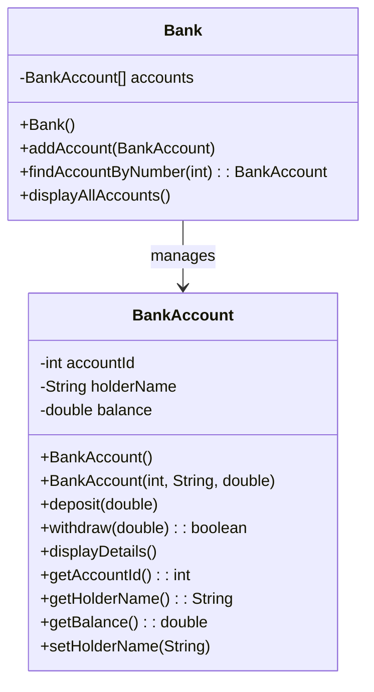
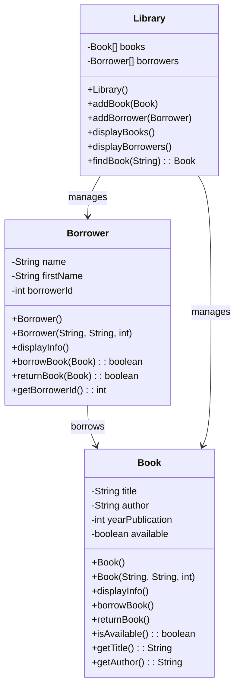
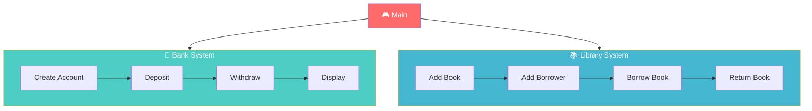
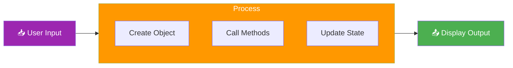

# 🏦 Java OOP: Bank & Library Management System

<p align="left">
  
  
  
  
</p>

---

[](https://java.com)

---

## 📋 Table of Contents

| Section | Description | Icon |
|---------|-------------|------|
| [1. Overview](#1-overview) | Project introduction | 🏠 |
| [2. Objectives](#2-objectives) | Learning goals | 🎯 |
| [3. Prerequisites](#3-prerequisites) | System requirements | 💻 |
| [4. Structure](#4-structure) | File organization | 📂 |
| [5. Methodology](#5-methodology) | Learning approach | 📖 |
| [6. Bank System](#6-bank-system) | Banking details | 🏦 |
| [7. Library System](#7-library-system) | Library details | 📚 |
| [8. Running Code](#8-running-code) | Execution guide | ▶️ |
| [9. UML Diagrams](#9-uml-diagrams) | Class diagrams | 📊 |
| [10. Features](#10-features) | Key features | ✨ |
| [11. Code Examples](#11-code-examples) | Code samples | 💻 |
| [12. Detailed Class Reference](#12-detailed-class-reference) | Full class documentation | 📖 |
| [13. Exercises](#13-exercises) | Practice exercises | 📝 |
| [14. Expected Outputs](#14-expected-outputs) | Sample outputs | 📊 |
| [15. Troubleshooting](#15-troubleshooting) | Common issues | 🔧 |
| [16. Best Practices](#16-best-practices) | OOP best practices | ✅ |
| [17. FAQ](#17-faq) | Help section | ❓ |
| [18. Resources](#18-resources) | Learning resources | 📚 |
| [19. License](#19-license) | License info | 📝 |
| [20. Author](#20-author) | Author info | 👤 |

---

## 1. Overview <a name="1-overview"></a>

### 1.1 Project Introduction

> 💡 **Course:** TP 03 - Classes et Objets  
> 🎓 **Institution:** EMSI (École Marocaine des Sciences de l'Ingénieur)  
> 👨‍💻 **Author:** Youssef Lagmouch  
> 📅 **Date:** 2026  
> 🎯 **Level:** Intermediate Java OOP

This Java project demonstrates **Object-Oriented Programming (OOP)** concepts through two practical management systems. The project is designed to help students master fundamental OOP principles including:

- **Encapsulation** - Data hiding and protection
- **Classes and Objects** - Building blocks of OOP
- **Constructors** - Object initialization
- **Methods** - Behavior implementation
- **Arrays** - Managing collections of objects
- **CRUD Operations** - Create, Read, Update, Delete

### 1.2 Project Motivation

This project was created as a practical exercise (TP03) for learning OOP fundamentals in Java. It provides hands-on experience with:

1. Designing and implementing classes
2. Working with object arrays
3. Implementing getter and setter methods
4. Managing object relationships
5. Building practical applications

### 1.3 Systems Overview

| System | Description | Icon | Complexity |
|--------|-------------|------|------------|
| 🏦 **Bank Management** | Account management with deposits, withdrawals | 💰 | ⭐⭐ |
| 📚 **Library Management** | Book and borrower management | 📖 | ⭐⭐ |

---

## 2. Objectives <a name="2-objectives"></a>

### 2.1 Learning Objectives

By completing this project, students will be able to:

| # | Objective | Description | Icon |
|---|-----------|-------------|------|
| 1 | Master Classes | Understand how to design and implement classes | 🏗️ |
| 2 | Create Objects | Learn object instantiation and initialization | 🎯 |
| 3 | Encapsulation | Implement data hiding with private attributes | 🔒 |
| 4 | Getters/Setters | Create accessor and mutator methods | 🔑 |
| 5 | Constructors | Understand different constructor types | 🏗️ |
| 6 | Arrays | Work with arrays of objects | 📊 |
| 7 | Methods | Implement various method types | ⚙️ |
| 8 | CRUD | Perform Create, Read, Update, Delete | 📝 |

### 2.2 Skills Matrix

| Level | Topic | Focus Area | Exercise | Duration |
|-------|-------|------------|----------|----------|
| ⭐ | Encapsulation | Data protection, private attributes | Bank Account | 45 min |
| ⭐⭐ | Class Design | Object creation, constructors | Bank Class | 60 min |
| ⭐⭐ | Arrays | Managing collections | Library Books | 50 min |
| ⭐⭐⭐ | CRUD Operations | Full application | Library System | 70 min |
| ⭐⭐⭐⭐ | Integration | Combine systems | Final Project | 90 min |

### 2.3 Competencies

After completing this project, you will have developed the following competencies:

- ✅ Java syntax proficiency
- ✅ OOP concept understanding
- ✅ Class design skills
- ✅ Problem-solving abilities
- ✅ Code organization
- ✅ Documentation skills

---

## 3. Prerequisites <a name="3-prerequisites"></a>

### 3.1 System Requirements

| Component | Minimum | Recommended | Status |
|-----------|---------|-------------|--------|
| ☕ Java | 17+ | 21+ | ✅ Required |
| 💾 RAM | 4 GB | 8 GB | ✅ Required |
| 💿 Disk | 100 MB | 500 MB | ✅ Required |
| 🖥️ OS | Win/Mac/Linux | Win 11/Mac/Ubuntu | ✅ Required |

### 3.2 Software Requirements

| Software | Version | Purpose | Status |
|----------|---------|---------|--------|
| JDK | 17+ | Java Development Kit | Required |
| IDE | IntelliJ/VS Code/Eclipse | Code Editor | Recommended |
| Git | Latest | Version Control | Optional |

### 3.3 Installation Guide

#### Windows Installation

```bash
# Option 1: Download from Oracle
# Visit: https://www.oracle.com/java/technologies/downloads/

# Option 2: Using Chocolatey
choco install openjdk17

# Option 3: Using Scoop
scoop install openjdk17

# Verify installation
java --version
javac --version
```

#### macOS Installation

```bash
# Option 1: Using Homebrew
brew install openjdk@17

# Set JAVA_HOME
echo 'export JAVA_HOME=$(/usr/libexec/java_home)' >> ~/.zshrc
source ~/.zshrc

# Option 2: Download from Oracle
# Visit: https://www.oracle.com/java/technologies/downloads/

# Verify installation
java --version
```

#### Linux Installation

```bash
# Ubuntu/Debian
sudo apt update
sudo apt install openjdk-17-jdk

# Fedora/RHEL
sudo dnf install java-17-openjdk-devel

# Arch Linux
sudo pacman -S jdk17-openjdk

# Verify installation
java --version
```

### 3.4 IDE Setup

#### IntelliJ IDEA

1. Download from https://www.jetbrains.com/idea/
2. Install and launch
3. Create new project → Java → JDK 17
4. Set up project structure

#### VS Code

1. Download from https://code.visualstudio.com/
2. Install Java Extension Pack
3. Create new file with .java extension

#### Eclipse

1. Download from https://www.eclipse.org/
2. Install Eclipse IDE for Java Developers
3. Create new Java Project

---

## 4. Structure <a name="4-structure"></a>

### 4.1 Project Architecture

```
📦 java-oop-bank-library
├── 📂 src
│   ├── 📂 bank
│   │   ├── Bank.java          🏛️ Bank management class
│   │   ├── BankAccount.java   💳 Bank account class
│   │   └── Main.java          🎮 Bank demo/main
│   │
│   └── 📂 library
│       ├── Book.java          📖 Book class
│       ├── Borrower.java      👤 Borrower class
│       ├── Library.java       🏛️ Library management
│       └── Main.java          🎮 Library demo/main
│
├── 📂 out                     📦 Compiled classes (generated)
├── README.md                  📝 This file
└── LICENSE                    📄 License file
```

### 4.2 File Descriptions

| File | Description | Lines | Class Type |
|------|-------------|-------|------------|
| Bank.java | Manages bank accounts | ~40 | Controller |
| BankAccount.java | Represents a bank account | ~60 | Model |
| Bank/Main.java | Bank system demo | ~100 | Main |
| Book.java | Represents a book | ~70 | Model |
| Borrower.java | Represents a borrower | ~50 | Model |
| Library.java | Manages books/borrowers | ~90 | Controller |
| Library/Main.java | Library system demo | ~150 | Main |

### 4.3 Package Structure

```
src/
├── bank/
│   ├── Bank.java
│   ├── BankAccount.java
│   └── Main.java
│
└── library/
    ├── Book.java
    ├── Borrower.java
    ├── Library.java
    └── Main.java
```

---

## 5. Methodology <a name="5-methodology"></a>

### 5.1 Learning Strategy


### 5.2 Development Process

| Step | Phase | Activities | Duration |
|------|-------|------------|----------|
| 1 | Analysis | Read requirements, identify classes | 15 min |
| 2 | Design | Create class diagrams, plan attributes | 20 min |
| 3 | Implementation | Write code, implement methods | 60 min |
| 4 | Testing | Run code, verify outputs | 20 min |
| 5 | Debugging | Fix errors, improve code | 15 min |
| 6 | Documentation | Comment code, create README | 15 min |

### 5.3 OOP Principles Applied

| Principle | Application in Project |
|-----------|----------------------|
| Encapsulation | Private attributes with public getters/setters |
| Abstraction | Complex operations hidden in methods |
| Inheritance | Not used (demonstrates basic OOP) |
| Polymorphism | Not used (demonstrates basic OOP) |

---

## 6. Bank System <a name="6-bank-system"></a>

### 6.1 Overview

The Bank Management System is a Java application that simulates basic banking operations. It allows users to create bank accounts, deposit money, withdraw money, and view account details.

### 6.2 Class: BankAccount

The BankAccount class represents a individual bank account with basic banking operations.

#### Attributes

| Attribute | Type | Access | Description |
|-----------|------|--------|-------------|
| accountId | int | private | Unique account identifier |
| holderName | String | private | Account holder's full name |
| balance | double | private | Current account balance |

#### Constructors

```java
// Default constructor
public BankAccount()

// Parameterized constructor
public BankAccount(int accountId, String holderName, double initialBalance)
```

#### Methods

| Method | Return Type | Description |
|--------|-------------|-------------|
| deposit(double amount) | void | Add money to account |
| withdraw(double amount) | boolean | Remove money (returns success) |
| displayDetails() | void | Print account information |
| getAccountId() | int | Get account ID |
| getHolderName() | String | Get holder name |
| getBalance() | double | Get current balance |
| setHolderName(String) | void | Set holder name |

#### Example Usage

```java
// Create a new account
BankAccount account = new BankAccount(1001, "John Doe", 5000.0);

// Deposit money
account.deposit(2000.0);

// Withdraw money
account.withdraw(1000.0);

// Display details
account.displayDetails();
```

### 6.3 Class: Bank

The Bank class manages a collection of bank accounts.

#### Attributes

| Attribute | Type | Access | Description |
|-----------|------|--------|-------------|
| accounts | BankAccount[] | private | Array of bank accounts |

#### Methods

| Method | Return Type | Description |
|--------|-------------|-------------|
| addAccount(BankAccount) | void | Add new account to bank |
| findAccountByNumber(int) | BankAccount | Search account by ID |
| displayAllAccounts() | void | Display all account details |

#### Example Usage

```java
// Create a bank
Bank bank = new Bank();

// Add accounts
bank.addAccount(new BankAccount(1001, "John Doe", 5000.0));
bank.addAccount(new BankAccount(1002, "Jane Smith", 10000.0));

// Find and display account
BankAccount found = bank.findAccountByNumber(1001);
if (found != null) {
    found.displayDetails();
}

// Display all accounts
bank.displayAllAccounts();
```

### 6.4 Bank System Features

| Feature | Description | Status |
|---------|-------------|--------|
| Create Account | Create new bank account with unique ID | ✅ |
| Deposit | Add money to account | ✅ |
| Withdraw | Remove money from account | ✅ |
| Check Balance | View current balance | ✅ |
| Search | Find account by ID | ✅ |
| Display All | List all accounts | ✅ |

---

## 7. Library System <a name="7-library-system"></a>

### 7.1 Overview

The Library Management System is a Java application that simulates basic library operations. It allows users to manage books, borrowers, and borrowing/returning books.

### 7.2 Class: Book

The Book class represents a book in the library.

#### Attributes

| Attribute | Type | Access | Description |
|-----------|------|--------|-------------|
| title | String | private | Book title |
| author | String | private | Book author |
| yearPublication | int | private | Publication year |
| available | boolean | private | Availability status |

#### Constructors

```java
// Default constructor
public Book()

// Parameterized constructor
public Book(String title, String author, int yearPublication)
```

#### Methods

| Method | Return Type | Description |
|--------|-------------|-------------|
| displayInfo() | void | Print book information |
| borrowBook() | void | Mark book as borrowed |
| returnBook() | void | Mark book as available |
| isAvailable() | boolean | Check availability |
| getTitle() | String | Get book title |
| getAuthor() | String | Get author name |

#### Example Usage

```java
// Create a book
Book book = new Book("The Great Gatsby", "F. Scott Fitzgerald", 1925);

// Display book info
book.displayInfo();

// Borrow the book
book.borrowBook();

// Return the book
book.returnBook();
```

### 7.3 Class: Borrower

The Borrower class represents a library borrower.

#### Attributes

| Attribute | Type | Access | Description |
|-----------|------|--------|-------------|
| name | String | private | Borrower's last name |
| firstName | String | private | Borrower's first name |
| borrowerId | int | private | Unique borrower ID |

#### Constructors

```java
// Default constructor
public Borrower()

// Parameterized constructor
public Borrower(String name, String firstName, int borrowerId)
```

#### Methods

| Method | Return Type | Description |
|--------|-------------|-------------|
| displayInfo() | void | Print borrower information |
| borrowBook(Book) | boolean | Borrow a book |
| returnBook(Book) | boolean | Return a book |
| getBorrowerId() | int | Get borrower ID |
| getName() | String | Get borrower name |

#### Example Usage

```java
// Create a borrower
Borrower borrower = new Borrower("Benali", "Ahmed", 1);

// Display borrower info
borrower.displayInfo();

// Borrow a book
borrower.borrowBook(book);

// Return the book
borrower.returnBook(book);
```

### 7.4 Class: Library

The Library class manages books and borrowers.

#### Attributes

| Attribute | Type | Access | Description |
|-----------|------|--------|-------------|
| books | Book[] | private | Array of books |
| borrowers | Borrower[] | private | Array of borrowers |

#### Methods

| Method | Return Type | Description |
|--------|-------------|-------------|
| addBook(Book) | void | Add book to library |
| addBorrower(Borrower) | void | Add borrower to library |
| displayBooks() | void | Display all books |
| displayBorrowers() | void | Display all borrowers |
| findBook(String) | Book | Search book by title |

#### Example Usage

```java
// Create a library
Library library = new Library();

// Add books
library.addBook(new Book("The Great Gatsby", "F. Scott Fitzgerald", 1925));
library.addBook(new Book("1984", "George Orwell", 1949));

// Add borrowers
library.addBorrower(new Borrower("Benali", "Ahmed", 1));

// Display all
library.displayBooks();
library.displayBorrowers();
```

### 7.5 Library System Features

| Feature | Description | Status |
|---------|-------------|--------|
| Add Book | Add new book to library | ✅ |
| Add Borrower | Register new borrower | ✅ |
| Borrow Book | Borrow a book | ✅ |
| Return Book | Return a borrowed book | ✅ |
| Display Books | List all books with status | ✅ |
| Display Borrowers | List all borrowers | ✅ |
| Availability Check | Check if book is available | ✅ |

---

## 8. Running Code <a name="8-running-code"></a>

### 8.1 Quick Start

```bash
# Clone the repository
git clone https://github.com/Lagmouchyoussef/java-oop-bank-library.git
cd java-oop-bank-library

# Compile the project
javac -d out src/bank/*.java src/library/*.java

# Run Bank System
java -cp out bank.Main

# Run Library System
java -cp out library.Main
```

### 8.2 Using IDE

#### IntelliJ IDEA

1. Open project in IntelliJ
2. Right-click on Main.java
3. Select "Run"
4. View output in console

#### VS Code

1. Open folder in VS Code
2. Open Main.java file
3. Click "Run" button (top right)
4. View output in terminal

#### Eclipse

1. Import project into Eclipse
2. Right-click on Main.java
3. Select "Run As" → "Java Application"
4. View output in console

### 8.3 Compilation Options

| Command | Description |
|---------|-------------|
| `javac src/bank/*.java` | Compile all bank classes |
| `javac src/library/*.java` | Compile all library classes |
| `javac -d out src/**/*.java` | Compile with output directory |
| `javac -encoding UTF-8 *.java` | Compile with UTF-8 encoding |

---

## 9. UML Diagrams <a name="9-uml-diagrams"></a>

### 9.1 Bank System UML



### 9.2 Library System UML



### 9.3 System Flow



### 9.4 Data Flow



---

## 10. Features <a name="10-features"></a>

### 🏦 Bank Management Features

| # | Feature | Description | Status |
|---|---------|-------------|--------|
| 1 | Create Account | Create bank accounts with unique IDs | ✅ |
| 2 | Deposit Money | Add money to accounts | ✅ |
| 3 | Withdraw Money | Remove money (with balance validation) | ✅ |
| 4 | Search Account | Find accounts by account number | ✅ |
| 5 | Display Accounts | Show all account details | ✅ |
| 6 | Balance Check | View current balance | ✅ |
| 7 | Account Validation | Validate sufficient balance | ✅ |

### 📚 Library Management Features

| # | Feature | Description | Status |
|---|---------|-------------|--------|
| 1 | Add Books | Add new books to library | ✅ |
| 2 | Add Borrowers | Register new borrowers | ✅ |
| 3 | Borrow Books | Borrow books (with availability check) | ✅ |
| 4 | Return Books | Return borrowed books | ✅ |
| 5 | Display Books | Show all books with status | ✅ |
| 6 | Display Borrowers | Show all borrowers | ✅ |
| 7 | Book Availability | Check if book is available | ✅ |
| 8 | Search Book | Find book by title | ✅ |

---

## 11. Code Examples <a name="11-code-examples"></a>

### 11.1 Bank Account Example

```java
// BankAccount.java
public class BankAccount {
    // Private attributes (Encapsulation)
    private int accountId;
    private String holderName;
    private double balance;
    
    // Constructor
    public BankAccount(int accountId, String holderName, double initialBalance) {
        this.accountId = accountId;
        this.holderName = holderName;
        this.balance = initialBalance;
    }
    
    // Deposit method
    public void deposit(double amount) {
        if (amount > 0) {
            balance += amount;
            System.out.println("Deposit successful!");
        }
    }
    
    // Withdraw method
    public boolean withdraw(double amount) {
        if (amount > 0 && balance >= amount) {
            balance -= amount;
            return true;
        }
        return false;
    }
    
    // Display method
    public void displayDetails() {
        System.out.println("Account ID: " + accountId);
        System.out.println("Holder: " + holderName);
        System.out.println("Balance: " + balance);
    }
    
    // Getters
    public int getAccountId() { return accountId; }
    public String getHolderName() { return holderName; }
    public double getBalance() { return balance; }
}
```

### 11.2 Bank Class Example

```java
// Bank.java
public class Bank {
    private BankAccount[] accounts;
    private int count;
    
    public Bank() {
        accounts = new BankAccount[100];
        count = 0;
    }
    
    public void addAccount(BankAccount account) {
        accounts[count++] = account;
    }
    
    public BankAccount findAccountByNumber(int accountNumber) {
        for (int i = 0; i < count; i++) {
            if (accounts[i].getAccountId() == accountNumber) {
                return accounts[i];
            }
        }
        return null;
    }
    
    public void displayAllAccounts() {
        for (int i = 0; i < count; i++) {
            accounts[i].displayDetails();
            System.out.println("---");
        }
    }
}
```

### 11.3 Book Class Example

```java
// Book.java
public class Book {
    private String title;
    private String author;
    private int yearPublication;
    private boolean available;
    
    public Book(String title, String author, int year) {
        this.title = title;
        this.author = author;
        this.yearPublication = year;
        this.available = true;
    }
    
    public void displayInfo() {
        System.out.println("Title: " + title);
        System.out.println("Author: " + author);
        System.out.println("Year: " + yearPublication);
        System.out.println("Available: " + (available ? "Yes" : "No"));
    }
    
    public void borrowBook() {
        if (available) {
            available = false;
            System.out.println("Book borrowed successfully!");
        } else {
            System.out.println("Book is not available!");
        }
    }
    
    public void returnBook() {
        available = true;
        System.out.println("Book returned successfully!");
    }
    
    public boolean isAvailable() {
        return available;
    }
}
```

---

## 12. Detailed Class Reference <a name="12-detailed-class-reference"></a>

### 12.1 BankAccount Class Reference

#### Class Declaration

```java
public class BankAccount
```

#### Attributes Detail

| Attribute | Type | Default | Access | Description |
|-----------|------|---------|--------|-------------|
| accountId | int | 0 | private | Unique account identifier |
| holderName | String | null | private | Account holder name |
| balance | double | 0.0 | private | Account balance |

#### Methods Detail

| Method | Parameters | Return | Visibility | Description |
|--------|------------|--------|------------|-------------|
| BankAccount | () | - | public | Default constructor |
| BankAccount | (int, String, double) | - | public | Parameterized constructor |
| deposit | (double) | void | public | Add amount to balance |
| withdraw | (double) | boolean | public | Subtract amount from balance |
| displayDetails | () | void | public | Print account info |
| getAccountId | () | int | public | Return account ID |
| getHolderName | () | String | public | Return holder name |
| getBalance | () | double | public | Return balance |
| setHolderName | (String) | void | public | Set holder name |

### 12.2 Bank Class Reference

#### Class Declaration

```java
public class Bank
```

#### Attributes Detail

| Attribute | Type | Default | Access | Description |
|-----------|------|---------|--------|-------------|
| accounts | BankAccount[] | new BankAccount[100] | private | Array of accounts |
| count | int | 0 | private | Number of accounts |

#### Methods Detail

| Method | Parameters | Return | Description |
|--------|------------|--------|-------------|
| Bank | () | - | Default constructor |
| addAccount | (BankAccount) | void | Add account to array |
| findAccountByNumber | (int) | BankAccount | Search by ID |
| displayAllAccounts | () | void | Print all accounts |

### 12.3 Book Class Reference

#### Class Declaration

```java
public class Book
```

#### Attributes Detail

| Attribute | Type | Default | Access | Description |
|-----------|------|---------|--------|-------------|
| title | String | null | private | Book title |
| author | String | null | private | Author name |
| yearPublication | int | 0 | private | Publication year |
| available | boolean | true | private | Availability status |

#### Methods Detail

| Method | Parameters | Return | Description |
|--------|------------|--------|-------------|
| Book | () | - | Default constructor |
| Book | (String, String, int) | - | Parameterized constructor |
| displayInfo | () | void | Print book details |
| borrowBook | () | void | Mark as borrowed |
| returnBook | () | void | Mark as available |
| isAvailable | () | boolean | Return availability |

### 12.4 Borrower Class Reference

#### Class Declaration

```java
public class Borrower
```

#### Attributes Detail

| Attribute | Type | Default | Access | Description |
|-----------|------|---------|--------|-------------|
| name | String | null | private | Last name |
| firstName | String | null | private | First name |
| borrowerId | int | 0 | private | Unique ID |

### 12.5 Library Class Reference

#### Class Declaration

```java
public class Library
```

#### Attributes Detail

| Attribute | Type | Default | Access | Description |
|-----------|------|---------|--------|-------------|
| books | Book[] | new Book[100] | private | Array of books |
| borrowers | Borrower[] | new Borrower[100] | private | Array of borrowers |

---

## 13. Exercises <a name="13-exercises"></a>

### 13.1 Exercise 1: Bank Account

**Difficulty:** ⭐ Beginner  
**Focus:** Encapsulation

**Task:** Create a BankAccount class with:
- Private attributes: accountId, holderName, balance
- Constructor to initialize all attributes
- deposit() method to add money
- withdraw() method to remove money
- displayDetails() method to show information
- Getter methods for all attributes

**Expected Output:**
```
Account ID: 1001
Holder: John Doe
Balance: 5000.0
Deposit of 2000: SUCCESS
Withdrawal of 1000: SUCCESS
New Balance: 6000.0
```

### 13.2 Exercise 2: Bank Management

**Difficulty:** ⭐⭐ Intermediate  
**Focus:** Arrays and Collections

**Task:** Create a Bank class that manages multiple accounts:
- Array to store BankAccount objects
- addAccount() method to add new accounts
- findAccountByNumber() method to search
- displayAllAccounts() method to show all

### 13.3 Exercise 3: Library Books

**Difficulty:** ⭐⭐ Intermediate  
**Focus:** Object Arrays

**Task:** Create a Library system:
- Book class with title, author, year, available
- Library class to manage books
- Add at least 5 books
- Display all books

### 13.4 Exercise 4: Borrower Management

**Difficulty:** ⭐⭐⭐ Advanced  
**Focus:** Full CRUD Operations

**Task:** Extend Library system:
- Add Borrower class
- Implement borrowBook() functionality
- Implement returnBook() functionality
- Track book availability
- Display borrower information

---

## 14. Expected Outputs <a name="14-expected-outputs"></a>

### 14.1 Bank System Output

```
========================================
       🏦 BANK SYSTEM DEMO 🏦
========================================

Creating accounts...
Account Created Successfully!

📊 ACCOUNT DETAILS
━━━━━━━━━━━━━━━━━━━━━━━━━━━━━━━━━━━━━━
Account ID:     1001
Holder Name:    John Doe
Initial Balance: 5000.0 MAD
━━━━━━━━━━━━━━━━━━━━━━━━━━━━━━━━━━━━━━

💰 OPERATION: Deposit
━━━━━━━━━━━━━━━━━━━━━━━━━━━━━━━━━━━━━━
Deposit Amount:  2000.0 MAD
Status:         SUCCESS ✓
New Balance:    7000.0 MAD
━━━━━━━━━━━━━━━━━━━━━━━━━━━━━━━━━━━━━━

💰 OPERATION: Withdrawal
━━━━━━━━━━━━━━━━━━━━━━━━━━━━━━━━━━━━━━
Withdrawal Amount: 1000.0 MAD
Status:            SUCCESS ✓
New Balance:       6000.0 MAD
━━━━━━━━━━━━━━━━━━━━━━━━━━━━━━━━━━━━━━

📋 ALL ACCOUNTS
━━━━━━━━━━━━━━━━━━━━━━━━━━━━━━━━━━━━━━
Account 1:
  ID: 1001
  Name: John Doe
  Balance: 6000.0 MAD

Account 2:
  ID: 1002
  Name: Jane Smith
  Balance: 15000.0 MAD

━━━━━━━━━━━━━━━━━━━━━━━━━━━━━━━━━━━━━━
Total Accounts: 2
========================================
```

### 14.2 Library System Output

```
========================================
      📚 LIBRARY SYSTEM DEMO 📚
========================================

📖 Adding Books...
Book Added Successfully!

📚 ALL BOOKS
━━━━━━━━━━━━━━━━━━━━━━━━━━━━━━━━━━━━━━
Book 1:
  Title: The Great Gatsby
  Author: F. Scott Fitzgerald
  Year: 1925
  Status: AVAILABLE ✓

Book 2:
  Title: 1984
  Author: George Orwell
  Year: 1949
  Status: AVAILABLE ✓
━━━━━━━━━━━━━━━━━━━━━━━━━━━━━━━━━━━━━━

👤 Adding Borrowers...
Borrower Registered!

📋 ALL BORROWERS
━━━━━━━━━━━━━━━━━━━━━━━━━━━━━━━━━━━━━━
Borrower 1:
  Name: Ahmed Benali
  ID: 1
━━━━━━━━━━━━━━━━━━━━━━━━━━━━━━━━━━━━━━

📕 Borrowing Book...
━━━━━━━━━━━━━━━━━━━━━━━━━━━━━━━━━━━━━━
Book: The Great Gatsby
Borrower: Ahmed Benali (ID: 1)
Status: BORROWED SUCCESSFULLY ✓
━━━━━━━━━━━━━━━━━━━━━━━━━━━━━━━━━━━━━━

📗 Returning Book...
━━━━━━━━━━━━━━━━━━━━━━━━━━━━━━━━━━━━━━
Book: The Great Gatsby
Status: RETURNED ✓
New Status: AVAILABLE ✓
━━━━━━━━━━━━━━━━━━━━━━━━━━━━━━━━━━━━━━
```

---

## 15. Troubleshooting <a name="15-troubleshooting"></a>

### 15.1 Common Compilation Errors

| Error | Cause | Solution |
|-------|-------|----------|
| cannot find symbol | Typo in class name | Check spelling |
| class, interface, or enum expected | Missing brace | Check braces |
| incompatible types | Type mismatch | Check variable types |
| method ... in class ... cannot be applied | Wrong parameters | Check method signature |

### 15.2 Common Runtime Errors

| Error | Cause | Solution |
|-------|-------|----------|
| NullPointerException | Using null object | Initialize objects |
| ArrayIndexOutOfBoundsException | Invalid index | Check array bounds |
| NumberFormatException | Invalid number format | Use correct parse method |

### 15.3 Debugging Tips

1. **Use System.out.println()** - Print values to trace execution
2. **Check null values** - Always initialize objects
3. **Verify array bounds** - Don't exceed array length
4. **Print error messages** - Show what's going wrong

---

## 16. Best Practices <a name="16-best-practices"></a>

### 16.1 Code Organization

| Practice | Description |
|----------|-------------|
| One class per file | Each class in separate file |
| Proper naming | Use meaningful names (camelCase) |
| Comments | Comment complex logic |
| Indentation | Use consistent indentation |

### 16.2 OOP Best Practices

| Practice | Description |
|----------|-------------|
| Encapsulation | Always use private attributes |
| Constructors | Provide default and parameterized |
| Getters/Setters | Use for data access |
| Single Responsibility | One class, one purpose |

### 16.3 Documentation

| Element | When to Document |
|---------|------------------|
| Classes | Every class |
| Methods | Complex methods |
| Attributes | Non-obvious purpose |
| Constants | All constants |

---

## 17. FAQ <a name="17-faq"></a>

### General Questions

**Q: What is this project about?**
A: A Java OOP project demonstrating classes, objects, encapsulation, and CRUD operations through Bank and Library management systems.

**Q: What Java version is required?**
A: Java 17 or higher is recommended.

**Q: Can I modify this code?**
A: Yes! Licensed under MIT. Feel free to use and modify.

**Q: How do I run individual modules?**
A: Use `java -cp out bank.Main` or `java -cp out library.Main`

**Q: Do I need an IDE?**
A: No, you can compile and run from command line.

**Q: How do I compile the project?**
A: Run `javac -d out src/**/*.java`

### Technical Questions

**Q: Why use encapsulation?**
A: To protect data and control access to class members.

**Q: Why use arrays?**
A: To store multiple objects of the same type efficiently.

**Q: What is CRUD?**
A: Create, Read, Update, Delete - basic database operations.

---

## 18. Resources <a name="18-resources"></a>

### 18.1 Recommended Reading

| Book | Author | Level |
|------|--------|-------|
| Head First Java | Kathy Sierra | Beginner |
| Effective Java | Joshua Bloch | Advanced |
| Clean Code | Robert Martin | All Levels |

### 18.2 Online Resources

| Resource | URL | Description |
|----------|-----|-------------|
| Oracle Java Docs | https://docs.oracle.com/javase/ | Official Java documentation |
| W3Schools Java | https://www.w3schools.com/java/ | Java tutorials |
| Java Point | https://www.javatpoint.com/java-oops | OOP concepts |

### 18.3 Video Tutorials

| Topic | Recommended Video | Duration |
|-------|------------------|----------|
| Java OOP Basics | Corey Schafer | 45 min |
| Classes & Objects | Telusko | 30 min |
| Encapsulation | Programming with Mosh | 20 min |

---

## 19. License <a name="19-license"></a>

<div align="center">

MIT License

Copyright (c) 2026 Youssef Lagmouch

Permission is hereby granted, free of charge, to any person obtaining a copy
of this software and associated documentation files (the "Software"), to deal
in the Software without restriction, including without limitation the rights
to use, copy, modify, merge, publish, distribute, sublicense, and/or sell
copies of the Software, and to permit persons to whom the Software is
furnished to do so, subject to the following conditions:

The above copyright notice and this permission notice shall be included in all
copies or substantial portions of the Software.

THE SOFTWARE IS PROVIDED "AS IS", WITHOUT WARRANTY OF ANY KIND, EXPRESS OR
IMPLIED, INCLUDING BUT NOT LIMITED TO THE WARRANTIES OF MERCHANTABILITY,
FITNESS FOR A PARTICULAR PURPOSE AND NONINFRINGEMENT. IN NO EVENT SHALL THE
AUTHORS OR COPYRIGHT HOLDERS BE LIABLE FOR ANY CLAIM, DAMAGES OR OTHER
LIABILITY, WHETHER IN AN ACTION OF CONTRACT, TORT OR OTHERWISE, ARISING FROM,
OUT OF OR IN CONNECTION WITH THE SOFTWARE OR THE USE OR OTHER DEALINGS IN THE
SOFTWARE.

---

## 20. Author <a name="20-author"></a>

<div align="center">

| | |
|:---|:---|
| 👨‍💻 | **Youssef Lagmouch** |
| 📧 | yousseflagmouxch@gmail.com |
| 🌍 | Morocco |

### Connect With Me

[](https://github.com/Lagmouchyoussef)
[](https://www.linkedin.com/in/youssef-lagmouch-51557a2b3/?locale=fr_FR)

</div>

---

<div align="center">

⭐ **Star this repository if you found it helpful!**

🚀 Happy Coding! Build Something Amazing! 🚀

</div>

---

<p align="center">

📝 **Project:** Java OOP Bank & Library Management System  
📅 **Last Updated:** 2026  
📊 **Version:** 1.0  
⭐ **Status:** Completed

</p>


