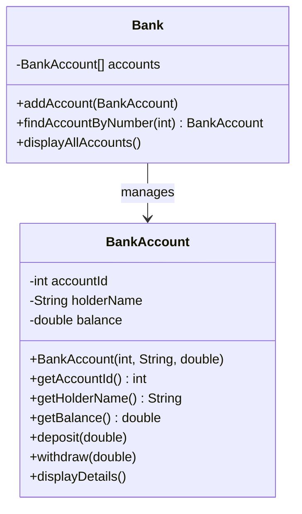
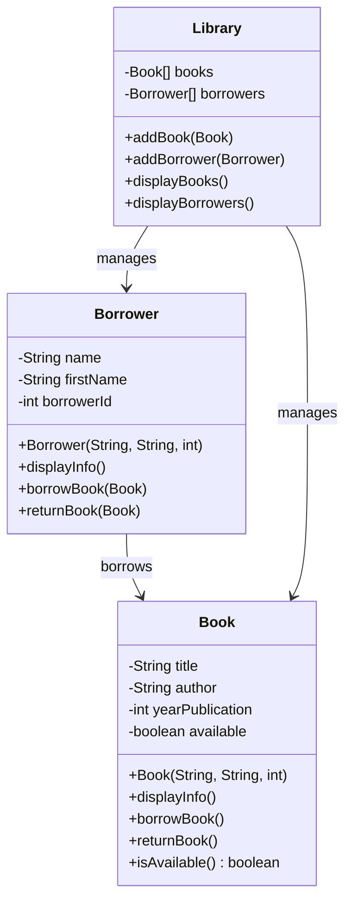
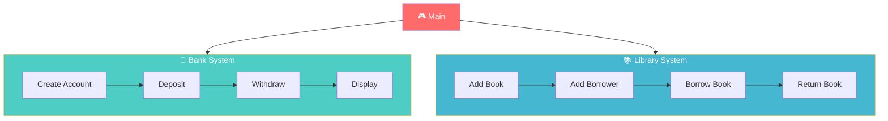

# 🏦 Java OOP: Bank & Library Management System

<p align="left">
  
  
  
  
</p>

---

[](https://java.com)

---

## 📋 Table of Contents

| Section | Description | Icon |
|---------|-------------|------|
| [1. Overview](#1-overview) | Project introduction | 🏠 |
| [2. Objectives](#2-objectives) | Learning goals | 🎯 |
| [3. Prerequisites](#3-prerequisites) | System requirements | 💻 |
| [4. Structure](#4-structure) | File organization | 📂 |
| [5. Methodology](#5-methodology) | Learning approach | 📖 |
| [6. Bank System](#6-bank-system) | Banking details | 🏦 |
| [7. Library System](#7-library-system) | Library details | 📚 |
| [8. Running Code](#8-running-code) | Execution guide | ▶️ |
| [9. UML Diagrams](#9-uml-diagrams) | Class diagrams | 📊 |
| [10. Features](#10-features) | Key features | ✨ |
| [11. FAQ](#11-faq) | Help section | ❓ |
| [12. License](#12-license) | License info | 📝 |

---

## 1. Overview <a name="1-overview"></a>

> 💡 **Course:** TP 03 - Classes et Objets  
> 🎓 **Institution:** EMSI (École Marocaine des Sciences de l'Ingénieur)  
> 👨‍💻 **Author:** Youssef Lagmouch

This Java project demonstrates **Object-Oriented Programming (OOP)** concepts through two practical management systems:

| System | Description | Icon |
|--------|-------------|------|
| 🏦 **Bank Management** | Account management with deposits, withdrawals | 💰 |
| 📚 **Library Management** | Book and borrower management | 📖 |

---

## 2. Objectives <a name="2-objectives"></a>

### Skills Matrix

| Level | Topic | Focus Area | Duration |
|-------|-------|------------|----------|
| ⭐ | Encapsulation | Data protection, private attributes | 45 min |
| ⭐⭐ | Class Design | Object creation, constructors | 60 min |
| ⭐⭐ | Arrays | Managing collections | 50 min |
| ⭐⭐⭐ | CRUD Operations | Create, Read, Update, Delete | 70 min |

---

## 3. Prerequisites <a name="3-prerequisites"></a>

### System Requirements

| Component | Minimum | Recommended | Status |
|-----------|---------|-------------|--------|
| ☕ Java | 17+ | 17+ | ✅ Required |
| 💾 RAM | 4 GB | 8 GB | ✅ Required |
| 💿 Disk | 100 MB | 500 MB | ✅ Required |
| 🖥️ OS | Win/Mac/Linux | Win 11/Mac/Ubuntu | ✅ Required |

### Installation Guide

<details>
<summary><b>Windows</b></summary>

```bash
# Download Java from Oracle
https://www.oracle.com/java/technologies/downloads/

# Or use OpenJDK
choco install openjdk17

# Verify
java --version
```
</details>

<details>
<summary><b>macOS</b></summary>

```bash
# Using Homebrew
brew install openjdk@17

# Set JAVA_HOME
export JAVA_HOME=$(/usr/libexec/java_home)

# Verify
java --version
```
</details>

<details>
<summary><b>Linux</b></summary>

```bash
# Ubuntu/Debian
sudo apt update
sudo apt install openjdk-17-jdk

# Verify
java --version
```
</details>

---

## 4. Structure <a name="4-structure"></a>

### Project Architecture

```
📦 java-oop-bank-library
├── 📂 src
│   ├── 📂 bank
│   │   ├── Bank.java          🏛️ Bank management class
│   │   ├── BankAccount.java   💳 Bank account class
│   │   └── Main.java          🎮 Bank demo
│   │
│   └── 📂 library
│       ├── Book.java          📖 Book class
│       ├── Borrower.java      👤 Borrower class
│       ├── Library.java       🏛️ Library management
│       └── Main.java          🎮 Library demo
│
├── README.md
└── LICENSE
```

---

## 5. Methodology <a name="5-methodology"></a>

### Learning Strategy


---

## 6. Bank System <a name="6-bank-system"></a>

### Class: BankAccount

| Attribute | Type | Description |
|-----------|------|-------------|
| accountId | int | Unique account ID |
| holderName | String | Account holder name |
| balance | double | Available balance |

**Methods:**
- `deposit(double)` ➕ Add money
- `withdraw(double)` ➖ Remove money
- `displayDetails()` 📊 Show info
- Getters/Setters 🔐

### Class: Bank

| Attribute | Type | Description |
|-----------|------|-------------|
| accounts | BankAccount[] | Array of accounts |

**Methods:**
- `addAccount(BankAccount)` ➕ Add account
- `findAccountByNumber(int)` 🔍 Search
- `displayAllAccounts()` 📋 List all

### Example Output

```
┌─────────────────────────────────────┐
│  🏦 Bank Account Created            │
│  ─────────────────────────────────  │
│  Account ID:    1001               │
│  Holder:        John Doe            │
│  Balance:       5000.0 MAD         │
└─────────────────────────────────────┘

💰 Deposit of 2000 MAD: SUCCESS
💰 Withdrawal of 1000 MAD: SUCCESS
📊 Current Balance: 6000.0 MAD
```

---

## 7. Library System <a name="7-library-system"></a>

### Class: Book

| Attribute | Type | Description |
|-----------|------|-------------|
| title | String | Book title |
| author | String | Book author |
| yearPublication | int | Publication year |
| available | boolean | Availability |

**Methods:**
- `displayInfo()` 📖 Show details
- `borrowBook()` 📕 Mark borrowed
- `returnBook()` 📗 Mark available

### Class: Borrower

| Attribute | Type | Description |
|-----------|------|-------------|
| name | String | Last name |
| firstName | String | First name |
| borrowerId | int | Unique ID |

### Class: Library

| Attribute | Type | Description |
|-----------|------|-------------|
| books | Book[] | Array of books |
| borrowers | Borrower[] | Array of borrowers |

### Example Output

```
📚 Library System
─────────────────
📖 Book Added: "The Great Gatsby"
   Author: F. Scott Fitzgerald
   Year: 1925
   Status: Available ✅

👤 Borrower Added: Ahmed Benali
   ID: 1

📕 Borrowing: The Great Gatsby
   Borrower: Ahmed Benali
   Status: BORROWED ❌
```

---

## 8. Running Code <a name="8-running-code"></a>

### Quick Start

```bash
# Clone the repository
git clone https://github.com/Lagmouchyoussef/java-oop-bank-library.git
cd java-oop-bank-library

# Compile the project
javac -d out src/bank/*.java src/library/*.java

# Run Bank System
java -cp out bank.Main

# Run Library System
java -cp out library.Main
```

### Expected Results

| Exercise | Output |
|----------|--------|
| 🏦 Bank | Account creation, deposits, withdrawals |
| 📚 Library | Book management, borrowing/returning |

---

## 9. UML Diagrams <a name="9-uml-diagrams"></a>

### Bank System UML



### Library System UML



### System Flow



---

## 10. Features <a name="10-features"></a>

### 🏦 Bank Management

| Feature | Description | Status |
|---------|-------------|--------|
| ➕ | Create bank accounts with unique IDs | ✅ |
| 💰 | Deposit money into accounts | ✅ |
| ➖ | Withdraw money (with balance validation) | ✅ |
| 🔍 | Search accounts by account number | ✅ |
| 📊 | Display all account details | ✅ |

### 📚 Library Management

| Feature | Description | Status |
|---------|-------------|--------|
| 📖 | Add and manage books | ✅ |
| 👤 | Add and manage borrowers | ✅ |
| 📕 | Borrow books (availability check) | ✅ |
| 📗 | Return books | ✅ |
| 📋 | Display book and borrower information | ✅ |

---

## 11. FAQ <a name="11-faq"></a>

<details>
<summary><b>Q: What is this project about?</b></summary>

A: A Java OOP project demonstrating classes, objects, encapsulation, and CRUD operations through Bank and Library management systems.
</details>

<details>
<summary><b>Q: What Java version is required?</b></summary>

A: Java 17 or higher is recommended.
</details>

<details>
<summary><b>Q: Can I modify this code?</b></summary>

A: Yes! Licensed under MIT. Feel free to use and modify.
</details>

<details>
<summary><b>Q: How do I run individual modules?</b></summary>

A: Use `java -cp out bank.Main` or `java -cp out library.Main`
</details>

---

## 12. License <a name="12-license"></a>

<div align="center">

MIT License

Copyright (c) 2026 Youssef Lagmouch

Permission is hereby granted, free of charge, to any person obtaining a copy
of this software and associated documentation files (the "Software"), to deal
in the Software without restriction, including without limitation the rights
to use, copy, modify, merge, publish, distribute, sublicense, and/or sell
copies of the Software, and to permit persons to whom the Software is
furnished to do so, subject to the following conditions:

The above copyright notice and this permission notice shall be included in all
copies or substantial portions of the Software.

THE SOFTWARE IS PROVIDED "AS IS", WITHOUT WARRANTY OF ANY KIND.

</div>

---

## 👤 Author

<div align="center">

| | |
|:---|:---|
| 👨‍💻 | **Youssef Lagmouch** |
| 🎓 | Computer Science Student |
| 🏫 | EMSI Morocco |
| 📧 | yousseflagmouxch@gmail.com |

[](https://github.com/Lagmouchyoussef)
[](https://linkedin.com/in/yousseflagmouch)

</div>

---

<div align="center">

⭐ **Star this repository if you found it helpful!**

🚀 Happy Coding! Build Something Amazing! 🚀

</div>
