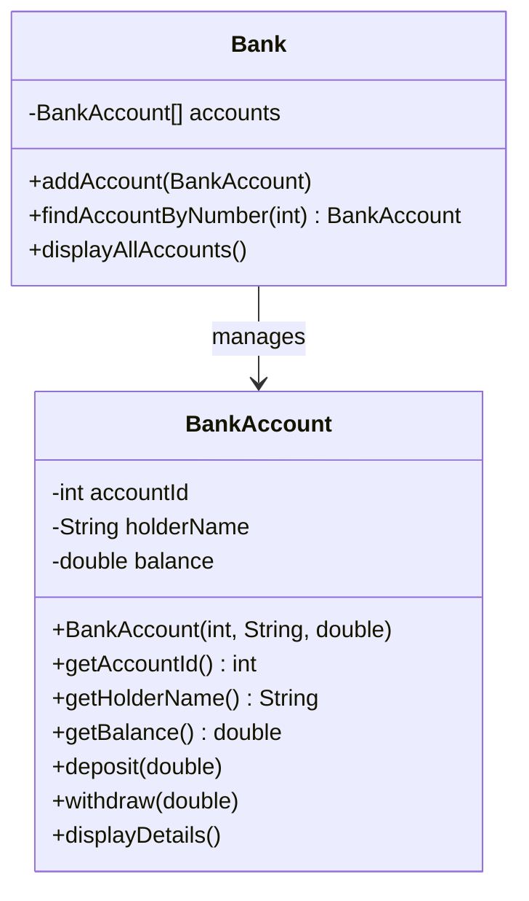
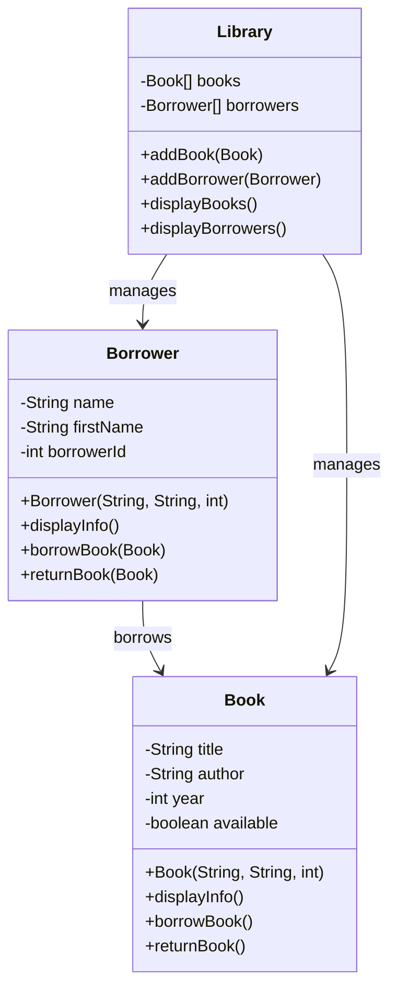
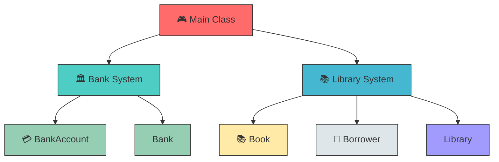

# 🚀 Java OOP Bank & Library Management System

[


---

## 📋 Table of Contents

| Section | Description |
|---------|-------------|
| [📖 About the Project](#about) | Project overview and introduction |
| [🎯 Objectives](#objectives) | Learning objectives |
| [🏗️ Architecture](#architecture) | System architecture and design |
| [💻 Technologies Used](#technologies) | Technologies and tools |
| [📁 Project Structure](#structure) | File and folder structure |
| [🔧 Installation](#installation) | How to install and run |
| [🚀 Usage](#usage) | How to use the project |
| [📊 UML Diagrams](#uml) | Class diagrams and relationships |
| [✨ Features](#features) | Key features of the project |
| [❓ FAQ](#faq) | Frequently Asked Questions |
| [📝 License](#license) | License information |
| [👤 Author](#author) | Author information |

---

## 📖 About the Project <a name="about"></a>

This project demonstrates **Object-Oriented Programming (OOP)** concepts in Java through two practical exercises:

## 📚 Exercise 1: Library Management System

A Java application for managing a library that handles books and borrowers.

### Classes Implemented

#### 📖 Book Class
| Attribute | Type | Description |
|-----------|------|-------------|
| `title` | String | Book title |
| `author` | String | Book author |
| `yearPublication` | int | Publication year |
| `available` | boolean | Availability status |

**Methods:**
- `displayInfo()` - Displays book information
- `borrowBook()` - Marks book as borrowed (if available)
- `returnBook()` - Marks book as available

#### 👤 Borrower Class
| Attribute | Type | Description |
|-----------|------|-------------|
| `name` | String | Borrower's last name |
| `firstName` | String | Borrower's first name |
| `borrowerId` | int | Unique borrower identifier |

**Methods:**
- `displayInfo()` - Displays borrower information
- `borrowBook(Book)` - Borrows a book if available
- `returnBook(Book)` - Returns a borrowed book

#### 🏛️ Library Class
| Attribute | Type | Description |
|-----------|------|-------------|
| `books` | Book[] | Array of books |
| `borrowers` | Borrower[] | Array of borrowers |

**Methods:**
- `addBook(Book)` - Adds a book to the library
- `addBorrower(Borrower)` - Adds a borrower to the library
- `displayBooks()` - Displays all books with availability
- `displayBorrowers()` - Displays all borrowers

### Use Case Scenario
1. Create Book and Borrower objects
2. Add books and borrowers to the library
3. Test borrowing and returning functionality
4. Display final state of books and borrowers

---

## 🏦 Exercise 2: Bank Management System

A Java application for managing bank accounts with deposits and withdrawals.

### Classes Implemented

#### 💳 BankAccount Class
| Attribute | Type | Description |
|-----------|------|-------------|
| `accountId` | int | Unique account identifier |
| `holderName` | String | Account holder's name |
| `balance` | double | Available account balance |

**Constructor:**
- `BankAccount(int accountId, String holderName, double initialBalance)`

**Methods:**
- `deposit(double amount)` - Adds amount to balance
- `withdraw(double amount)` - Subtracts amount (if sufficient balance)
- `displayDetails()` - Shows account number, holder name, and balance
- Getters and Setters for all attributes

#### 🏛️ Bank Class
| Attribute | Type | Description |
|-----------|------|-------------|
| `accounts` | BankAccount[] | Array of bank accounts |

**Methods:**
- `addAccount(BankAccount)` - Adds a new account to the bank
- `findAccountByNumber(int accountNumber)` - Searches account by ID
- `displayAllAccounts()` - Displays all account details

#### 🎮 Main Class
Demonstrates:
- Creating accounts
- Searching accounts by number
- Performing deposits
- Performing withdrawals
- Displaying all accounts

---

> **💡 Note:** This project was created as a practical exercise (TP03) for learning OOP fundamentals in Java.

---

## 🎯 Objectives <a name="objectives"></a>

| Objective | Description |
|-----------|-------------|
| 🎓 | Master **classes** and **objects** concepts |
| 🔒 | Understand **encapsulation** and **data hiding** |
| 🏗️ | Learn **class design** and **object relationships** |
| ⚙️ | Implement **CRUD operations** (Create, Read, Update, Delete) |
| 🧪 | Practice **testing** and **debugging** OOP code |
| 📈 | Apply **real-world** problem solving |

---

## 🏗️ Architecture <a name="architecture"></a>

```
┌─────────────────────────────────────────────────────────────┐
│                    📦 Java OOP Project                       │
├─────────────────────────────────────────────────────────────┤
│                                                             │
│   ┌─────────────────────┐    ┌─────────────────────┐      │
│   │   🏛️ BANK MODULE    │    │  📚 LIBRARY MODULE   │      │
│   ├─────────────────────┤    ├─────────────────────┤      │
│   │                     │    │                     │      │
│   │  ┌───────────────┐  │    │  ┌───────────────┐  │      │
│   │  │ BankAccount   │  │    │  │ Book          │  │      │
│   │  ├───────────────┤  │    │  ├───────────────┤  │      │
│   │  │ - accountId   │  │    │  │ - title       │  │      │
│   │  │ - holderName  │  │    │  │ - author      │  │      │
│   │  │ - balance     │  │    │  │ - year        │  │      │
│   │  ├───────────────┤  │    │  │ - available   │  │      │
│   │  │ + deposit()   │  │    │  ├───────────────┤  │      │
│   │  │ + withdraw()  │  │    │  │ + borrowBook() │  │      │
│   │  │ + display()   │  │    │  │ + returnBook() │  │      │
│   │  └───────────────┘  │    │  │ + displayInfo()│  │      │
│   │                     │    │  └───────────────┘  │      │
│   │  ┌───────────────┐  │    │                     │      │
│   │  │ Bank          │  │    │  ┌───────────────┐  │      │
│   │  ├───────────────┤  │    │  │ Borrower      │  │      │
│   │  │ - accounts[]  │  │    │  ├───────────────┤  │      │
│   │  ├───────────────┤  │    │  │ - name        │  │      │
│   │  │ + addAccount()│ │    │  │ - firstName   │  │      │
│   │  │ + findAccount │  │    │  │ - borrowerId  │  │      │
│   │  │ + displayAll()│  │    │  ├───────────────┤  │      │
│   │  └───────────────┘  │    │  │ + borrow()    │  │      │
│   │                     │    │  │ + returnBook()│  │      │
│   └─────────────────────┘    │  └───────────────┘  │      │
│                              │                     │      │
│                              │  ┌───────────────┐  │      │
│                              │  │ Library       │  │      │
│                              │  ├───────────────┤  │      │
│                              │  │ - books[]     │  │      │
│                              │  │ - borrowers[] │  │      │
│                              │  ├───────────────┤  │      │
│                              │  │ + addBook()   │  │      │
│                              │  │ + addBorrower │  │      │
│                              │  │ + displayAll()│  │      │
│                              │  └───────────────┘  │      │
│                              └─────────────────────┘      │
│                                                             │
└─────────────────────────────────────────────────────────────┘
```

---

## 💻 Technologies Used <a name="technologies"></a>

<div align="center">


</div>

| 🛠️ Technology | 📌 Version | 📝 Purpose |
|---------------|-----------|------------|
| ☕ Java | 17+ | Programming Language |
| 💡 IntelliJ IDEA | Latest | IDE |
| 📝 Visual Studio Code | Latest | Code Editor |
| 📦 Git | Latest | Version Control |

---

## 📁 Project Structure <a name="structure"></a>

```
📦 java-oop-bank-library
├── 📂 src
│   ├── 📂 bank
│   │   ├── 🏛️ Bank.java          # Bank management class
│   │   ├── 💳 BankAccount.java   # Bank account class
│   │   └── 🎮 Main.java          # Bank demo
│   │
│   ├── 📂 library
│   │   ├── 📚 Book.java          # Book class
│   │   ├── 👤 Borrower.java      # Borrower class
│   │   ├── 🏛️ Library.java       # Library management class
│   │   └── 🎮 Main.java          # Library demo
│   │
│   └── 🎮 Main.java              # Main entry point
│
├── 📂 build                      # Compiled classes
├── 📄 .gitignore
├── 📊 README.md
└── 📋 TP3_OOP_Project.iml
```

---

## 🔧 Installation <a name="installation"></a>

### 📋 Prerequisites

| 📌 Requirement | 💾 Version |
|---------------|-----------|
| ☕ JDK | 17 or higher |
| 💾 RAM | 4GB minimum |
| 💿 Disk | 100MB free space |

### 🚀 Steps

```bash
# 📥 1️⃣ Clone the repository
git clone https://github.com/yousseflagmouch/java-oop-bank-library.git

# 📂 2️⃣ Navigate to project directory
cd java-oop-bank-library

# ⚙️ 3️⃣ Compile the project
javac -d build src/**/*.java

# ▶️ 4️⃣ Run the project
java -cp build Main
```

---

## 🚀 Usage <a name="usage"></a>

### 🏛️ Running the Bank Application

```java
// 🏛️ Create a new bank
Bank bank = new Bank();

// ➕ Add accounts
bank.addAccount(new BankAccount(1001, "John Doe", 5000.00));
bank.addAccount(new BankAccount(1002, "Jane Smith", 10000.00));

// 💰 Perform operations
bank.findAccountByNumber(1001).deposit(1000);
bank.findAccountByNumber(1001).withdraw(500);

// 📊 Display all accounts
bank.displayAllAccounts();
```

### 📚 Running the Library Application

```java
// 🏛️ Create a library
Library library = new Library();

// 📖 Add books
library.addBook(new Book("The Great Gatsby", "F. Scott Fitzgerald", 1925));
library.addBook(new Book("1984", "George Orwell", 1949));

// 👤 Add borrowers
library.addBorrower(new Borrower("Ahmed", "Benali", 1));

// 📕 Borrow a book
Book book = library.books[0];
Borrower borrower = library.borrowers[0];
borrower.borrowBook(book);

// 📚 Display all
library.displayBooks();
library.displayBorrowers();
```

---

## 📊 UML Diagrams <a name="uml"></a>

### Bank System UML



### Library System UML



### Class Relationships



---

## ✨ Features <a name="features"></a>

### 🏛️ Bank Management System

| ✨ Feature | 📝 Description |
|------------|----------------|
| ✅ | Create bank accounts with unique IDs |
| ✅ | Deposit money into accounts |
| ✅ | Withdraw money (with balance validation) |
| ✅ | Search accounts by account number |
| ✅ | Display all account details |

### 📚 Library Management System

| ✨ Feature | 📝 Description |
|------------|----------------|
| ✅ | Add and manage books |
| ✅ | Add and manage borrowers |
| ✅ | Borrow books (availability check) |
| ✅ | Return books |
| ✅ | Display book and borrower information |

---

## ❓ FAQ <a name="faq"></a>

### Q: What is this project about?
**A:** This is a Java project demonstrating Object-Oriented Programming (OOP) concepts through Bank and Library management systems.

### Q: What Java version is required?
**A:** Java 17 or higher is recommended.

### Q: Can I use this code for my own projects?
**A:** Yes! This project is licensed under the MIT License.

### Q: How do I run the project?
**A:** Compile with `javac -d build src/**/*.java` and run with `java -cp build Main`

---

## 📝 License <a name="license"></a>

<div align="center">


This project is licensed under the **MIT License**.

📄 **Permissions:**
- ✅ Commercial use
- ✅ Modification
- ✅ Distribution
- ✅ Private use

📛 **Conditions:**
- ⚠️ License and copyright notice required

📚 **Limitations:**
- ❌ No liability
- ❌ No warranty

</div>

---

## 👤 Author <a name="author"></a>

<div align="center">

| | |
|:---:|:---|
| 👨‍💻 | **Youssef Lagmouch** |
| 🎓 | Computer Science Student |
| 🏫 | EMSI (École Marocaine des Sciences de l'Ingénieur) |
| 📧 | youssef.lagmouch@email.com |
| 🌍 | Morocco |

### Connect With Me

[](https://github.com/yousseflagmouch)
[](https://linkedin.com/in/yousseflagmouch)
[](https://twitter.com/yousseflagmouch)

</div>

---

<div align="center">

⭐ Star this repository if you found it helpful!

Made with ❤️ and ☕ by **Youssef Lagmouch**

</div>
